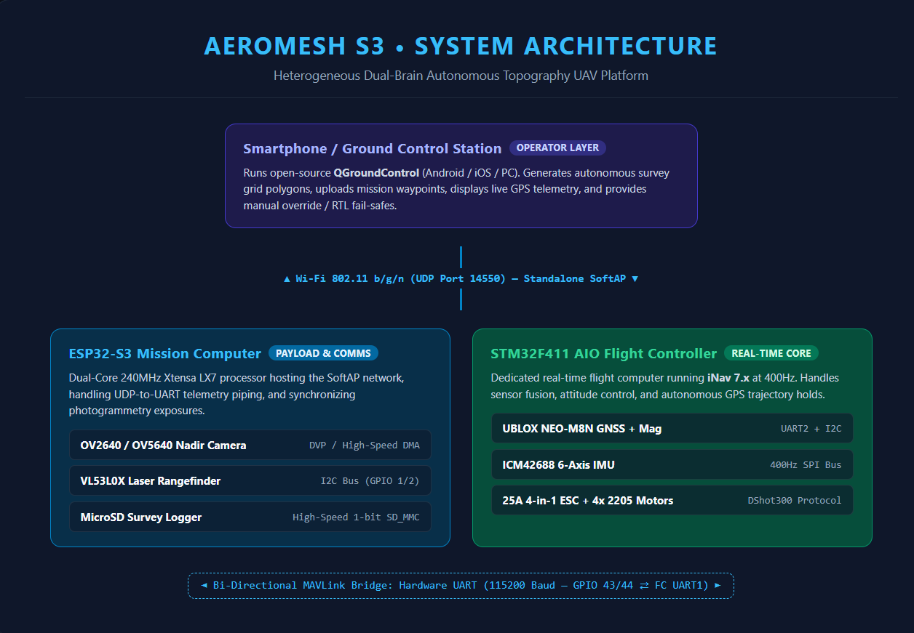
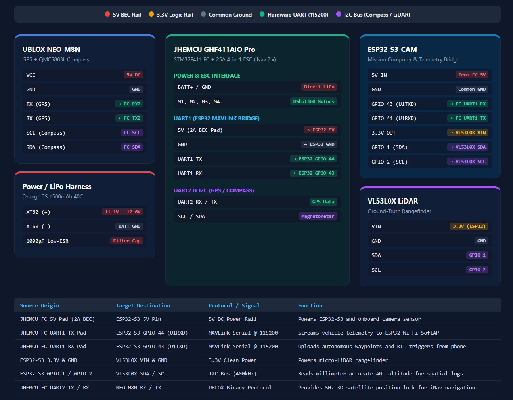

## AeroMesh S3


An open-source, autonomous 3D aerial mapping drone controlled directly from a smartphone. AeroMesh S3 eliminates costly proprietary radio transmitters by implementing an onboard ESP32-S3 Wi-Fi MAVLink telemetry bridge, pairing autonomous waypoint navigation with a laser-synchronized downward photogrammetry payload for under $170(₹14,100).

## 1. Project Overview

* **The Problem:** Enterprise aerial surveying systems(such as Wingtra or senseFly) cost upwards of $5k to $ 10k , making photogrammetric mapping inaccessible to students, independent researchers, and small-scale agriculture.

* **The Limitation of Hobby Drones:** Standard DIY quadcopters require an expensive $80+ dedicated radio controller, use upward-tilted cameras suited only for manual racing, and capture uncalibrated video clips rather than structure, geo-referenced spatial data.

* **The Solution:** AeroMesh S3 is a sub-$170 mapping platform that executes automated lawnmower survey grids without a physical RC transmitter. It uses an onboard ESP32-S3 microcontroller to create a local Wi-Fi telemetry bridge, allowing any smartphone running **QGroundControl** to dispatch missons, monitor live metrics, and trigger fail-safes.

## 2. Heterogeneous Dual-Brain Architecture

Running flight stabilization loops alongside camera and Wi-Fi streaming on a single microcontroller introduces RTOS thread latency and task contention. AeroMesh S3 separates flight stabilization from mission compute across two dedicated microcontrollers:

```text 
[Smartphone/ Ground Control Station]
          |
          |
          |
          ▼
[Mission Computer: ESP32-S3]
          |────MicroSD Card (High-speed SPI: Stores JPEG frames and CSV spatial logs)
          |────VL53L0X Laser Rangefinder (I2C: Measures real-time ground clearance)
          |
          |────Hardware UART(115200 Baud- bi-directional MAVLink Bridge)
          ▼
[Flight Controller: STM32F411 AIO]
          |────UBLOX NEO-M8N GPS + Compass(Autonomous waypoint navigation)
          |────ICM42688 IMU( 400Hz real-time attitude stabilization via iNav)
          |
          └──── 25A 4-in-1 ESC + 4X 2205 Brushless Motors
```


* **The Real-Time Brain (STM32F411):** Runs iNav flight firmware, dedicating all compute cycles to sensor filtering, attitude stabilization, and motor drive via DShot protocols.
* **The Mission Brain (ESP32-S3):** Broadcasts a local Wi-Fi Access Point, routes MAVLink telemetry packets to QGroundControl, triggers the downward camera, and logs distance data from the laser sensor.
-------

## 3. Ground Control and Smartphone Connection

1. **Standalone Wi-Fi Hotspot:** The ESP32-S3 chip broadcasts a local Wi-Fi network after boot. There is no need for any router, mobile internet, or cellular towers.

2. **QGroundControl Integration:** You have to connect your mobile device or laptop to the drone's Wi-Fi and open the open-source **QGroundControl** app. It creates a connection over UDP port 14550.

3. **Autonomous Grid Survey:** In QGroundControl, select the Survey Tool and draw a polygon over the survey area. The app calculates flight lines with a 75% photo overlap sideways and forwards. To arm the drone, click or tap on **"Upload & Start Mission"**, the drone arms itself and performs the survey autonomously returning to the launch point.

4. **Emergency Controls & Fail-Safes:** The bi-directional telemetry is maintained by the ground station. A single tap to the screen triggers **Return to Launch (RTL)**, instructing the flight controller to fly back to the base using GPS and land safely. Virtual touch joystick and proper emergency motor-kill controls are also present.

## 4. Data Pipeline & 3D Reconstruction

During autonomous flight, the ESP32-S3 triggers the downward camera every 4 meters of horizontal movement and reads the VL53L0X micro-LiDAR to record the exact distance to the ground. Each entry is saved to the onboard MicroSD card:

```csv
Frame_ID,Timestamp_ms,Latitude,Longitude,Baro_Altitude_m,Laser_AGL_mm
IMG_0001.JPG,124820,26.84671,80.94612,20.40,19820
IMG_0002.JPG,126840,26.84674,80.94618,20.35,19790
```

### What Happens with the Captured Data?
After landing of the drone, the MicroSD cards is plugged to a pc using either WebODM or Gaussian Splatting tool:

* **3D Models (`.obj`/ `.ply`):** The software generates a high-resolution 3D polygon mesh that can be used to build a game level and or/ an architectural model in Blender, Unity, or Unreal Engine.

* **Digital Elevation Model (DEM):** Colorized topographic elevation maps shows erosion, slopes, and zones that contain pooling water.

* **Volumetric Analysis:** This feature can calculate the volume of gravel, compost, soil etc. It can also find the volume of soil that was excavated. It does not require field surveying and can be done on a computer.

---

## 5. Hardware Specifications & Bill of Materials

All components are verified in-stock from authorized domestic Indian suppliers (Robu.in / JLCPCB) with 18% GST included:

| Component Category | Exact Hardware Specification | Supplier | Cost (INR) | Cost (USD) |
| :--- | :--- | :--- | :---: | :---: |
| **Airframe** | Mark4 5-inch 3K Carbon Fiber Quadcopter Frame | Robu.in | ₹1,199 | $14.32 |
| **Motors** | ReadyToSky RS2205 2300KV Brushless Motors (Set of 4) | Robu.in | ₹3,200 | $38.21 |
| **Flight Stack** | JHEMCU GHF411AIO Pro 25A F4 2-4S AIO Flight Controller + ESC | Robu.in | ₹3,999 | $47.75 |
| **GNSS & Compass** | UBLOX NEO-M8N GPS Module with Active Ceramic Antenna | Robu.in | ₹1,399 | $16.70 |
| **Flight Battery** | Orange 3S 1500 mAh 40C/50C LiPo Battery Pack (XT60) | Robu.in | ₹1,150 | $13.73 |
| **Balance Charger** | B3 Pro 10W 2S-3S Compact Balance Charger | Robu.in | ₹450 | $5.37 |
| **Propellers** | Gemfan 5045 3-Blade Polycarbonate Propellers (2 Pairs) | Robu.in | ₹250 | $2.99 |
| **Vision & Compute**| ESP32-S3-CAM Development Board with OV2640 + MicroSD Slot | Robu.in | ₹999 | $11.93 |
| **LiDAR Altimeter** | VL53L0X Time-of-Flight Micro-LiDAR Distance Sensor | Robu.in | ₹380 | $4.54 |
| **Carrier Shield** | Custom 2-Layer Interconnect Board (5 pcs batch) | JLCPCB | ₹650 | $7.76 |
| **Wiring & Hardware**| XT60 lead, M2/M3 nylon standoffs, 1000 µF Cap, wires | Robu.in | ₹350 | $4.18 |
| **Total System Cost** | **Complete Autonomous 3D Topography Drone** | — | **₹14,026** | **$167.47** |

---

## 6. Electrical Pinout and Wiring



### Flight Controller(STM32F411) to ESP32-S3-CAM:
* `FC 5V(2A BEC Pad)` $\rightarrow$ `ESP32 5V`
* `FC GND` $\rightarrow$ `ESP32 GND`
* `FC UART1 RX` $\rightarrow$ `ESP32 GPIO 43(U1TXD)`
* `FC UART1 TX` $\rightarrow$ `ESP32 GPIO 44(U1RXD)`

### ESP32-S3-CAM to VL53L0X Time-of-Flight Sensor
* `ESP32 3.3V` $\rightarrow$ `VL53L0X VIN`
* `ESP32 GND` $\rightarrow$ `VL53L0X GND`
* `ESP32 GPIO 1` $\rightarrow$ `VL53L0X SDA`
* `ESP32 GPIO 2` $\rightarrow$ `VL53L0X SCL`

### Flight Controller to UBLOX NEO-M8N GPS
* `FC 5V` $\rightarrow$ `GPS VCC`
* `FC GND` $\rightarrow$ `GPS GND`
* `FC UART2 RX` $\rightarrow$ `GPS TX`
* `FC UART2 TX` $\rightarrow$ `GPS RX`
* `FC SCL / SDA` $\rightarrow$ `Compass SCL / SDA`

---

## 7.Repository Structure
```text
|
├──data/
|  └──sample_survey_log.csv   # Validated spatial survey log (frames & LiDAR AGL)
|
├──docs/
|    ├──system_architecture.png    # Dual-brain architecture block diagram
|    └──wiring_schematic.png       # Complete pin-to-pin wiring diagram
|
├──firmware/
|     ├──esp32_mavlink_bridge/  #SoftAP & UDP-to-UART bridge script
|     |  └──esp32_mavlink_bridge.ino
|     ├──survey_logger/         #Camera capture & ToF laser logger loop
|     |  └──surevey_logger.ino
|     └──inav_cli_diff.txt
|
├──hardware/
|   ├──3d_mounts/
|   |  ├── camera_lidar_nadir_mount.scad  # Editable OpenSCAD source (Nadir mount)
|   |  ├── camera_lidar_nadir_mount.stl
|   |  ├── landing_skid_leg.scad     # Editable OpenSCAD source (35mm landing skids)
|   |  └──landing_skid_leg.stl     ## 35mm ground-clearance arm skid
|   ├──carrier_shield/             # Gerber production files for interconnect PCB
|   └──BOM.md          # Detailed parts breakdown & supplier links    
└── README.md
```   

## 8. Setup & Build Order

1. **Firmware Installation:** Install firmware iNav 7.x for STM32F411 AIO. Set `UART1` for 115200 baud-rate communication of MAVLink telemetry, set `UART2` for UBLOX GPS communication.

2. **ESP32 Bridge Installation:** Upload `firmware/esp32_mavlink_bridge` firmware to ESP32-S3 via Arduino IDE / PlatformIO in order to create an independent UDP-to-UART channel.

3. **Bench Verification:** Test sensor synchronization over USB. Ensure that triggering a capture writes a test frame and matching laser distance to the MicroSD memory.

4. **Mechanical Assembly:** Assemble the 2205 motors and 4-in-1 ESC to the Mark4 frame. Connect optical and laser sensors in the vibration-resistant mount located at the bottom of the quadcopter.

5. **Calibration and Flight in the Field:** Calibrate the compass in the absence of magnetic field influence, get 3D GPS satellite position lock, and send out a survey grid in QGroundControl application on your phone.

